# Unpack

A von Neumann probe game for Pebble.

You arrive in an uncharted system with a seed payload and no infrastructure.
Unpack yourself into power and extraction, work the bodies you find, and build
what the colonists will arrive to -- factories, colony frames, and finally the
orbital ring you leave through. The system keeps interrupting with decisions
that have no clean answer, and the clock never stops for them. A run takes 2-4
minutes, start to departure or failure. Runs entirely on the watch, no phone.

## Screenshots
### Pebble Classic/Steel
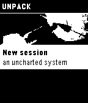
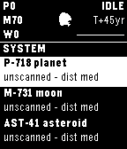
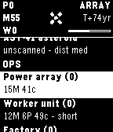

### Pebble 2/Duo
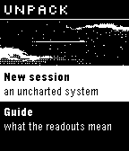
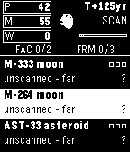
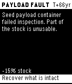

### Pebble Time/Time Steel
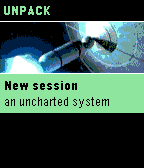
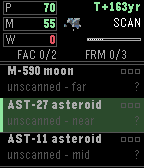
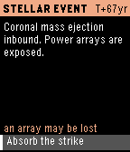

### Pebble Time Round
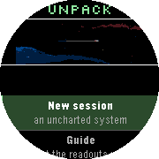
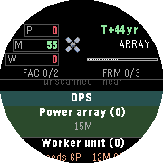
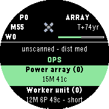

### Pebble Time 2
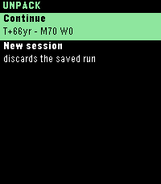
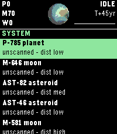
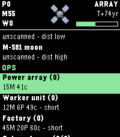

### Pebble Time Round 2
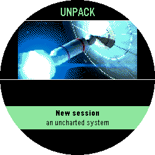
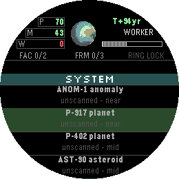
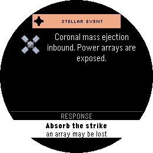

## Store
[Rebble App Store](https://apps.rebble.io/en_US/application/)
[Pebble App Store](https://apps.repebble.com/)

## License
MIT License - feel free to modify and share!